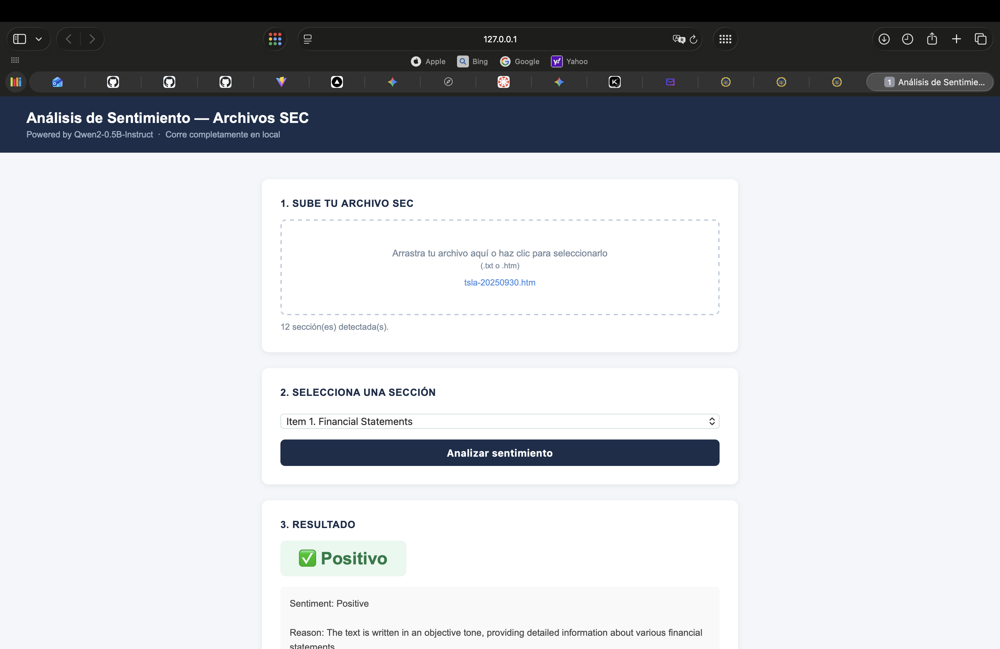

# Análisis de Sentimiento — Archivos SEC

App que analiza el sentimiento de archivos de la SEC usando [Qwen2-0.5B-Instruct](https://huggingface.co/Qwen/Qwen2-0.5B-Instruct). Corre completamente en local, sin API keys. Disponible en línea en [Hugging Face Spaces](https://huggingface.co/spaces/ncanudas/sentimiento-sec).



## Cómo usarla

1. Sube un archivo de la SEC (.txt o .htm)
2. Selecciona la sección que quieres analizar (se detectan automáticamente)
3. Haz clic en "Analizar sentimiento"

## Instalación local

```bash
pip install -r requirements.txt
python app.py
```

Abre `http://localhost:7860` en tu navegador.

## Secciones detectadas automáticamente

La app identifica las secciones estándar de los reportes de la SEC:
`Item 1 Business`, `Item 1A Risk Factors`, `Item 7 MD&A`, etc.
